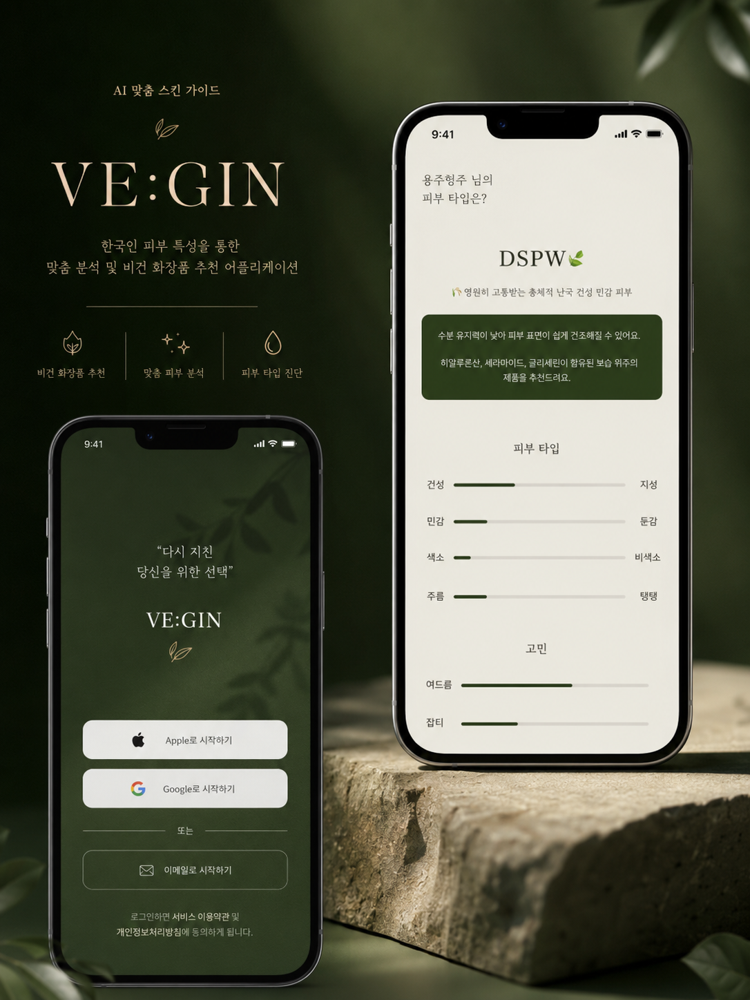
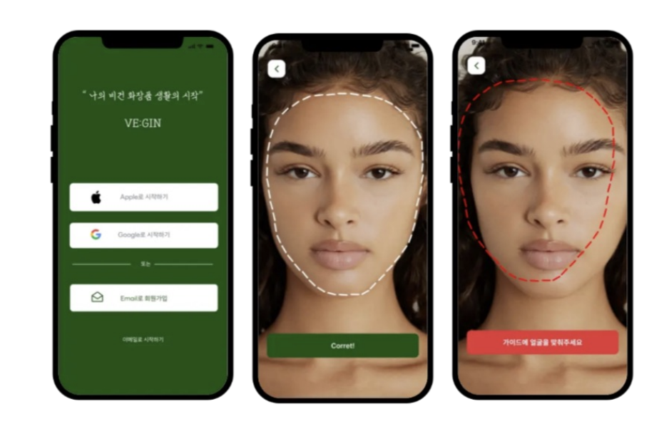
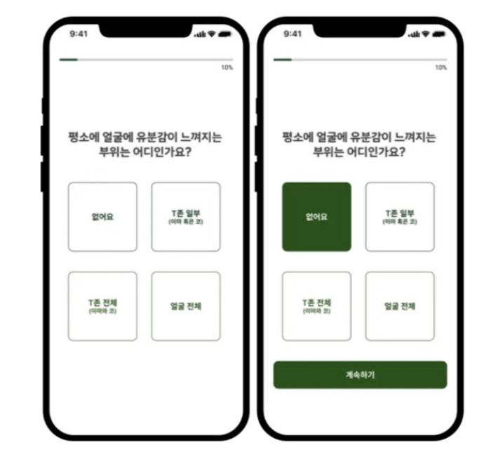
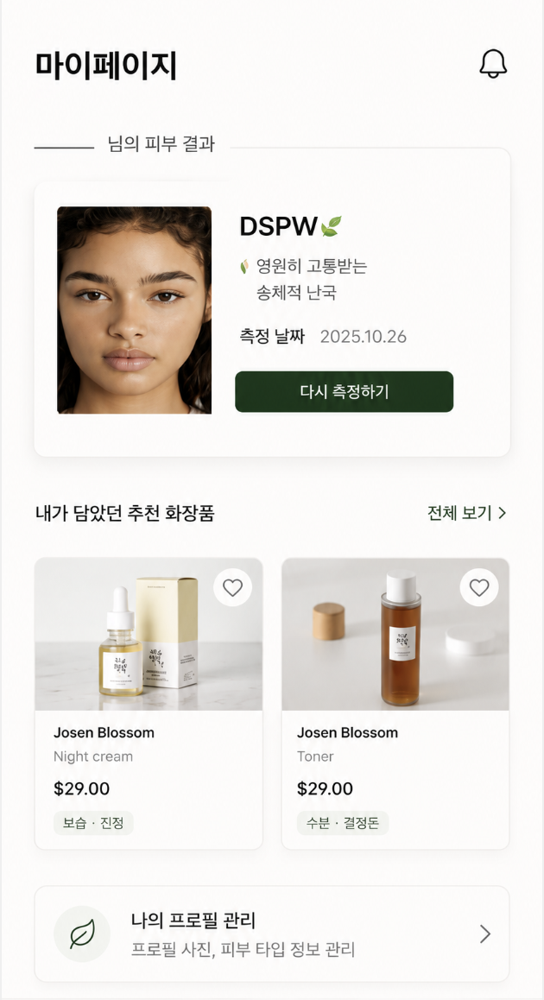
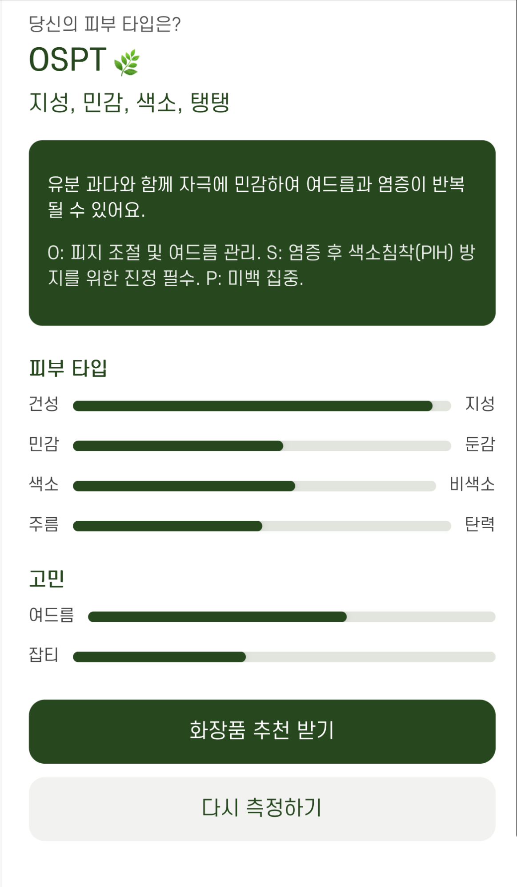
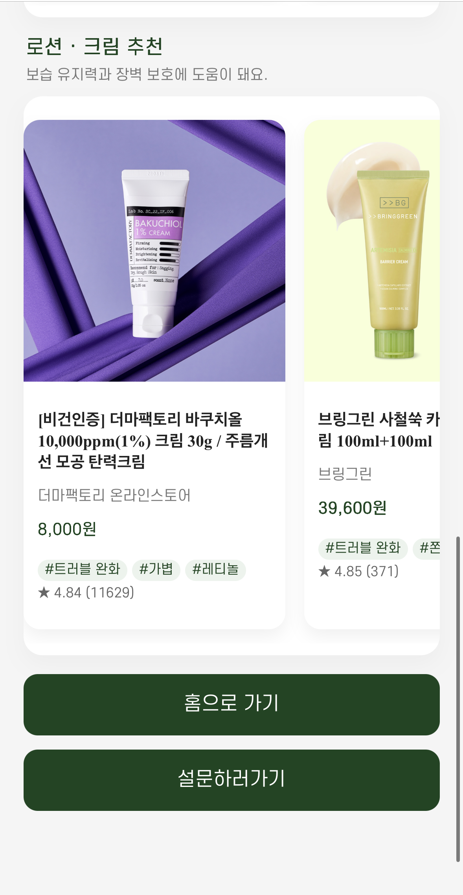
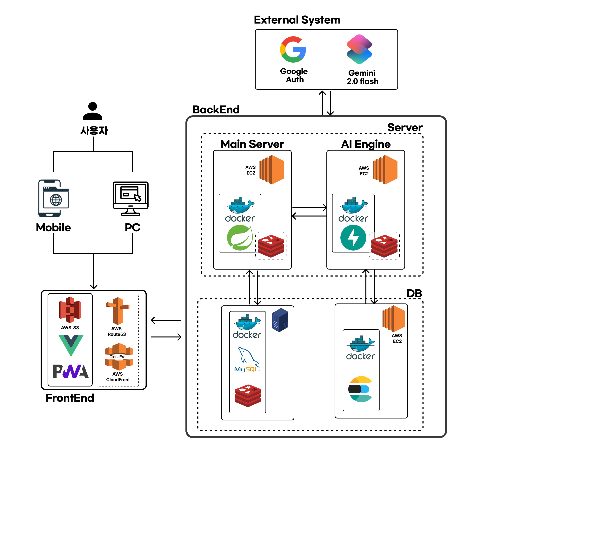
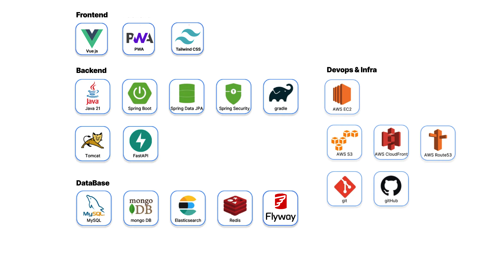

<div align="center">



# 🌿 VE:GIN

`나의 비건 화장품 생활의 시작`

[](https://vuejs.org/)
[](https://www.typescriptlang.org/)
[](https://spring.io/projects/spring-boot)
[](https://fastapi.tiangolo.com/)
[](https://ai.google.dev/edge/mediapipe/solutions/guide)

[🔗 서비스 바로가기](https://vegin.academy) · [📑 API 문서](./backend/API_DOCUMENTATION.md) · [🐛 이슈](https://github.com/JJutron/AI-Capstone-2/issues)

</div>

<br />

## 프로젝트 소개

**VE:GIN**은 얼굴 이미지와 피부 설문을 함께 분석해 개인의 피부 상태를 알려주고, 피부 특성에 맞는 **비건 화장품**을 추천하는 AI 기반 서비스입니다.

기존의 화장품 탐색 과정은 사용자가 자신의 피부 상태를 정확히 알기 어렵고, 수많은 제품 중 어떤 성분과 제품이 자신에게 맞는지 직접 판단해야 한다는 문제가 있습니다. VE:GIN은 촬영부터 피부 분석, 성분 가이드, 제품 추천까지 하나의 모바일 웹 흐름으로 연결해 이 문제를 해결하고자 했습니다.

| 문제 | 해결 |
| --- | --- |
| 사용자가 자신의 피부 상태를 객관적으로 파악하기 어려움 | 얼굴 이미지와 10문항 피부 설문을 결합한 AI 분석 제공 |
| 복잡한 분석 수치는 이해하기 어려움 | 유·수분, 민감도, 색소, 탄력 축을 조합한 16가지 **Skin MBTI**로 시각화 |
| 피부 타입에 맞는 성분과 제품을 직접 찾기 번거로움 | 추천·주의 성분과 카테고리별 비건 화장품을 한 화면에서 제안 |
| 촬영 환경에 따라 분석용 얼굴 이미지의 품질이 달라짐 | MediaPipe 기반 실시간 얼굴 위치 가이드와 촬영 카운트다운 적용 |

> 이 저장소는 Vue 프론트엔드와 Spring Boot 백엔드를 함께 관리합니다. 실제 피부 분석과 추천 모델은 별도의 FastAPI 서버에서 처리하며, Spring Boot가 인증·이미지 저장·분석 요청·결과 영속화를 담당합니다.

<br />

## 핵심 기능

### 1. 회원가입 및 로그인

이메일과 비밀번호로 가입·로그인할 수 있으며 Google OAuth2 로그인도 지원합니다. 로그인 성공 시 발급된 JWT는 이후 프로필과 피부 분석 등 보호된 API 요청에 자동으로 포함됩니다.

### 2. 실시간 얼굴 인식 및 촬영 가이드

MediaPipe Face Mesh로 얼굴의 주요 랜드마크를 실시간 추적합니다. 얼굴이 타원형 가이드 안에 들어온 경우에만 촬영 버튼이 활성화되며, 3초 카운트다운 도중 얼굴이 가이드를 벗어나면 촬영을 취소해 분석에 적합한 이미지를 얻도록 했습니다.

### 3. 피부 상태 설문

유분, 건조함, 홍조, 여드름, 주름, 색소 등 피부 상태를 확인하는 10개 문항을 단계별로 제공합니다. 선택한 답변과 진행률을 유지하고, 마지막 문항을 완료하면 촬영 이미지와 함께 분석 서버로 전달합니다.

### 4. AI 피부 분석

촬영 이미지와 설문을 결합해 유·수분, 민감도, 주름, 색소 지표와 여드름·홍조·잡티 등 주요 고민을 분석합니다. 분석 결과는 16가지 Skin MBTI 중 하나로 분류해 사용자가 자신의 피부 특성을 직관적으로 이해할 수 있도록 구성했습니다.

### 5. 성분 가이드

Skin MBTI별 피부 설명과 함께 도움이 되는 추천 성분과 피해야 할 주의 성분을 제공합니다. 단순 점수 표시에 그치지 않고 결과에 맞는 관리 방향까지 확인할 수 있습니다.

### 6. 맞춤형 비건 화장품 추천

분석 결과에 맞는 제품을 스킨·토너, 앰플·세럼, 로션·크림 카테고리로 나누어 보여줍니다. 제품별 브랜드, 가격, 리뷰, 추천 근거 키워드를 제공하며 네이버 쇼핑 검색으로 연결됩니다.

### 7. 분석 결과 및 이력 관리

최근 촬영 이미지와 분석 일자, Skin MBTI, 추천 제품을 홈에서 다시 확인할 수 있습니다. 마이페이지에서는 프로필, 전체 분석 이력, 최신 추천 정보를 함께 조회할 수 있습니다.

<br />

## 주요 화면

### 실시간 얼굴 인식 및 피부 설문

| 실시간 얼굴 인식 및 촬영 가이드 | 피부 상태 설문 |
| :---: | :---: |
|  |  |

### 분석 결과 및 맞춤 가이드

| 분석 결과 및 이력 관리 | 성분 가이드 | 맞춤형 비건 화장품 추천 |
| :---: | :---: | :---: |
|  |  |  |

<br />

## 서비스 흐름

```text
회원가입·로그인
      ↓
실시간 얼굴 가이드 → 얼굴 촬영
      ↓
피부 설문 10문항
      ↓
이미지 S3 저장 → FastAPI 분석·추천
      ↓
Skin MBTI · 피부 고민 · 성분 가이드
      ↓
카테고리별 비건 화장품 추천
```

<div align="center">
  
</div>

<br />

## 기술적으로 신경 쓴 부분

<details>
<summary><b>MediaPipe 랜드마크 기반 촬영 품질 제어</b></summary>
<br />

카메라 화면만 제공하면 얼굴이 너무 작거나 가이드 밖에 있는 이미지도 분석 요청에 사용될 수 있습니다. MediaPipe Face Mesh가 반환하는 코·입·양쪽 눈의 핵심 랜드마크를 화면 좌표로 변환한 뒤, 타원 방정식으로 가이드 내부 포함 여부를 실시간 판별했습니다.

핵심 랜드마크가 기준을 충족할 때만 촬영을 허용하고, 3초 카운트다운 중 조건이 깨지면 즉시 타이머를 취소합니다. 컴포넌트가 해제될 때 카메라 트랙과 애니메이션 프레임도 정리해 불필요한 카메라 점유를 방지했습니다.

</details>

<details>
<summary><b>이미지와 JSON을 함께 보내는 multipart 요청 처리</b></summary>
<br />

피부 분석 API는 이미지 파일과 구조화된 설문 JSON을 하나의 `multipart/form-data` 요청으로 받아야 합니다. 프론트엔드에서 설문 답변을 `q1`부터 `q10`까지의 객체로 변환하고, `application/json` 타입의 `Blob`으로 만들어 이미지와 함께 전송했습니다.

이때 `Content-Type`을 직접 지정하면 multipart boundary가 누락될 수 있으므로 Axios 인터셉터에서 FormData 요청의 헤더를 제거하고 브라우저가 boundary를 자동 생성하도록 처리했습니다. Spring Boot에서는 `@RequestPart`로 파일과 `SurveyDto`를 각각 역직렬화합니다.

</details>

<details>
<summary><b>S3 · Spring Boot · FastAPI 분석 파이프라인 연결</b></summary>
<br />

Spring Boot는 사용자별 경로와 UUID를 조합해 충돌 없는 S3 Object Key를 만들고 이미지를 업로드합니다. 이후 분석 레코드를 `PENDING` 상태로 저장한 뒤 S3 이미지 URL과 설문 JSON을 FastAPI에 전달하고, 응답을 JSON으로 영속화하면서 상태를 `DONE`으로 변경합니다.

프론트엔드는 업로드 응답의 `analysisId`로 결과 API를 조회하고, AI 서버의 원본 응답을 화면에서 사용하는 Skin MBTI·피부 지표·추천 제품 구조로 매핑합니다. 분석 데이터와 화면 표현의 결합도를 낮추고 분석 이력을 다시 조회할 수 있도록 구성했습니다.

</details>

<details>
<summary><b>Skin MBTI별 설명과 성분 정보를 도메인화</b></summary>
<br />

AI가 반환하는 Skin MBTI 코드만으로는 사용자에게 충분한 설명을 제공하기 어렵습니다. 백엔드에 16가지 타입별 헤드라인, 피부 설명, 추천 성분, 관리 방향, 주의 성분을 enum으로 정의하고 분석 결과와 결합해 응답하도록 구현했습니다.

AI 모델의 분류 결과와 서비스가 제공하는 콘텐츠를 분리해 문구를 일관되게 관리하고, 프론트엔드가 타입별 분기 로직을 반복하지 않도록 했습니다.

</details>

<details>
<summary><b>JWT와 Google OAuth2를 하나의 인증 흐름으로 통합</b></summary>
<br />

이메일 로그인과 Google OAuth2 로그인 모두 최종적으로 JWT를 발급하도록 통일했습니다. Spring Security는 stateless 세션으로 동작하며, 커스텀 필터가 Bearer 토큰을 검증해 인증 컨텍스트를 구성합니다.

프론트엔드에서는 Axios 요청 인터셉터가 저장된 토큰을 모든 보호 API에 추가하고, `401` 응답을 받으면 만료된 토큰을 제거한 뒤 로그인 화면으로 이동시킵니다.

</details>

<br />

## 기술 스택

<div align="center">
  
</div>

<br />

**Frontend**

`Vue 3 (Composition API)` · `TypeScript` · `Vite` · `Pinia` · `Vue Router` · `Axios` · `MediaPipe Face Mesh`

**Backend**

`Java 17` · `Spring Boot 3.5` · `Spring Security` · `JWT` · `OAuth2` · `Spring Data JPA` · `SpringDoc OpenAPI`

**AI / Data**

`FastAPI` · `Custom Vision Model` · `MySQL 8` · `Redis 7` · `Flyway`

**Infrastructure**

`AWS EC2` · `S3` · `CloudFront` · `Route 53` · `Docker`

<br />

## 폴더 구조

```text
AI-Capstone-2/
├── assets/                         # README 이미지
├── frontend/
│   ├── src/
│   │   ├── api/                    # Axios 인스턴스 및 API 함수
│   │   ├── assets/                 # 이미지·아이콘
│   │   ├── components/             # 공통 UI 컴포넌트
│   │   ├── stores/                 # 사용자·설문·분석 Pinia 스토어
│   │   ├── views/                  # 라우트 단위 화면
│   │   ├── router.ts               # Vue Router 설정
│   │   └── main.ts                 # 애플리케이션 진입점
│   └── vite.config.ts              # Vite·개발 프록시 설정
└── backend/
    ├── src/main/java/com/vegin/
    │   ├── auth/                   # JWT·OAuth2 인증
    │   ├── common/                 # 공통 응답·S3 연동
    │   ├── config/                 # Security·CORS·OpenAPI 설정
    │   ├── external/               # FastAPI 클라이언트
    │   ├── module/analysis/        # 피부 분석 도메인
    │   └── module/users/           # 사용자·프로필 도메인
    ├── src/main/resources/
    │   └── db/migration/           # Flyway 마이그레이션
    ├── src/test/                   # 백엔드 테스트
    └── docker-compose.yml          # MySQL·Redis 개발 환경
```

<br />

## Getting Started

### 사전 요구 사항

- Node.js 20 이상, npm
- JDK 17
- Docker, Docker Compose

### 1. 저장소 복제

```bash
git clone https://github.com/JJutron/AI-Capstone-2.git
cd AI-Capstone-2
```

### 2. MySQL 및 Redis 실행

`backend/.env`를 생성합니다.

```dotenv
MYSQL_ROOT_PASSWORD=rootpass
MYSQL_DATABASE=vegin
MYSQL_USER=vegin
MYSQL_PASSWORD=devpass
REDIS_PORT=6379
```

```bash
cd backend
docker compose up -d
```

### 3. 백엔드 실행

Google OAuth2, JWT, AWS S3, FastAPI 주소 등 실행 환경에 필요한 설정을 구성한 뒤 서버를 실행합니다. 민감한 값은 저장소에 커밋하지 마세요.

```bash
cd backend
./gradlew bootRun
```

- API: `http://localhost:8080`
- Swagger UI: `http://localhost:8080/swagger-ui/index.html`
- 상세 설정: [Backend README](./backend/README.md)

### 4. 프론트엔드 실행

```bash
cd frontend
npm ci
VITE_API_URL=http://localhost:8080 npm run dev
```

개발 서버는 기본적으로 `https://localhost:5173`에서 실행됩니다. 로컬 HTTPS 인증서 설치 권한을 요청할 수 있습니다. 자세한 내용은 [Frontend README](./frontend/README.md)를 참고하세요.

<br />

## 주요 API

| Method | Endpoint | 설명 | 인증 |
| --- | --- | --- | :---: |
| `POST` | `/api/auth/signup` | 이메일 회원가입 | - |
| `POST` | `/api/auth/login` | 로그인 및 JWT 발급 | - |
| `GET` | `/api/profile` | 프로필·최근 분석·이력 조회 | JWT |
| `PUT` | `/api/profile` | 피부 프로필 생성·수정 | JWT |
| `POST` | `/api/analysis/image` | 얼굴 이미지와 설문 업로드 및 분석 | JWT |
| `GET` | `/api/analysis/{analysisId}` | 피부 분석 결과 조회 | JWT |

요청과 응답 예시는 [API 문서](./backend/API_DOCUMENTATION.md)에서 확인할 수 있습니다.

<br />

## Team

AI 융합 캡스톤 디자인 프로젝트

| PM · Backend · AI · Infra · Frontend | Frontend · Design | AI | Crawling |
| :---: | :---: | :---: | :---: |
| 김형주 | 장연주 | 임용하 | 김정욱 |

**김형주 (PM, Backend)** — 서비스 기획, Spring Boot API 및 인증, AI 서버 연동, AWS 인프라 구성, 프론트엔드 기능 구현

<br />

## License

이 저장소는 AI 융합 캡스톤 디자인 프로젝트를 위해 제작되었습니다.
